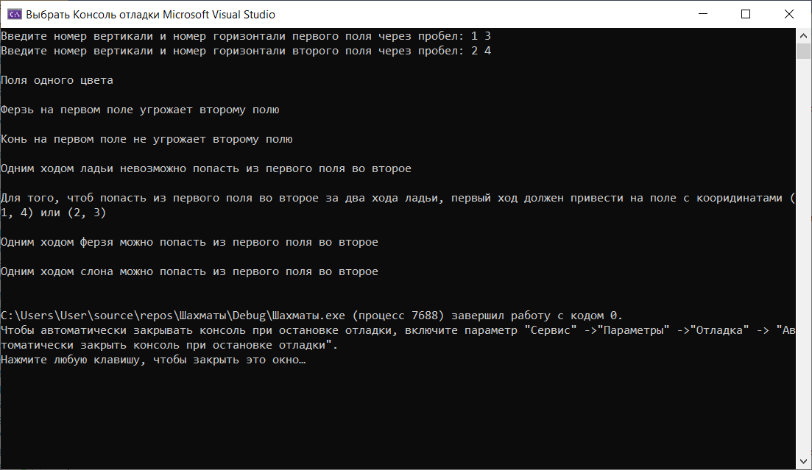
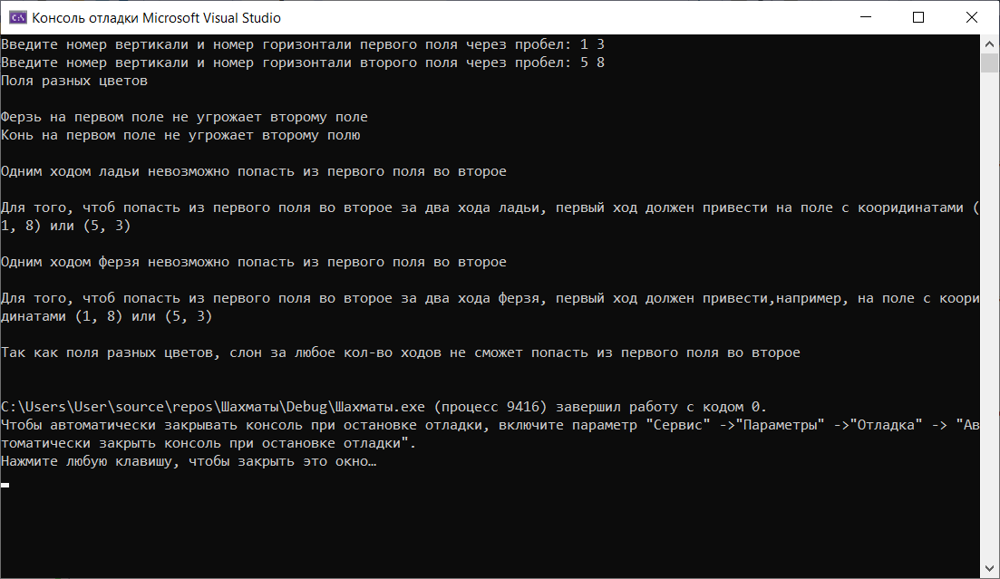
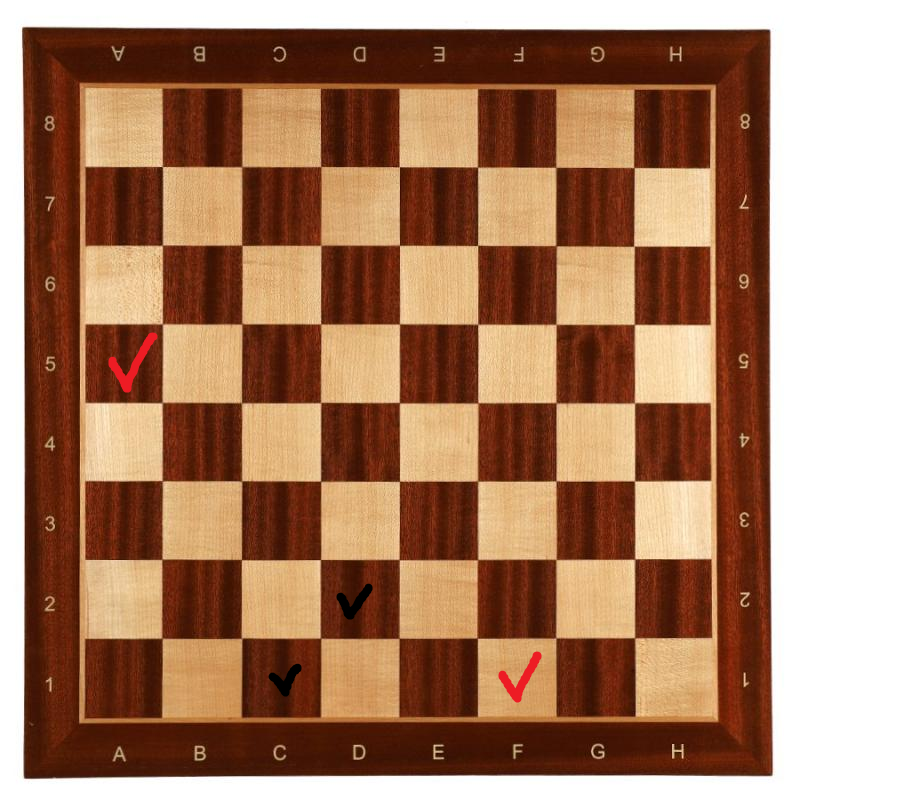
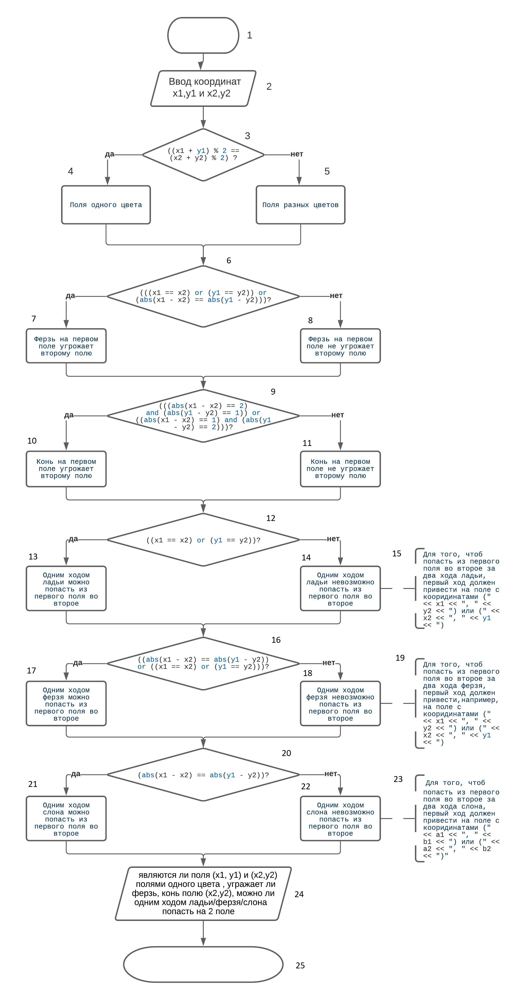

# Shess

## Решение задач на шахматной доске 

Данная программа реализует решения поставленных задач :

а) Выяснить, являются ли поля (k, I) и (m, n) полями одного цвета.

6) На поле (к, I) расположен ферзь. Угрожает ли он полю (m, n)?

в) На поле (к, I) расположен конь. Угрожает ли он полю (m, n)?

г) Выяснить, можно ли с поля (k, I) одним ходом ладьи попасть на поле (m, n). Если нет, то выяснить, как это можно сделать за два хода (указать поле, на которое приводит первый ход).

д) Выяснить, можно ли с поля (k, I) одним ходом ферзя попасть на поле (m, n). Если нет, то выяснить, как это можно сделать за два хода (указать поле, на которое приводит первый ход).

е) Выяснить, можно ли с поля (k, I) одним ходом слона попасть на поле (m, n). Если нет, то выяснить, как это можно сделать за два хода (указать поле, на которое приводит первый ход).

Приложение было раздаботано в среде Microsoft Visual Studio Community 2019. Поэтому самый удобный запуск его будет осуществлён именно там. Для открытия проекта необходимо открыть файл *.sln в корне репозитория.

При запуске программы мы видим консоль, которая запрашивает координаты 1 и 2 поля : 1 вариант

2 варинт 

На доске чёрным цветом указаны положения 1 варинта , а красным 2 

Блок-схема работы программы 

